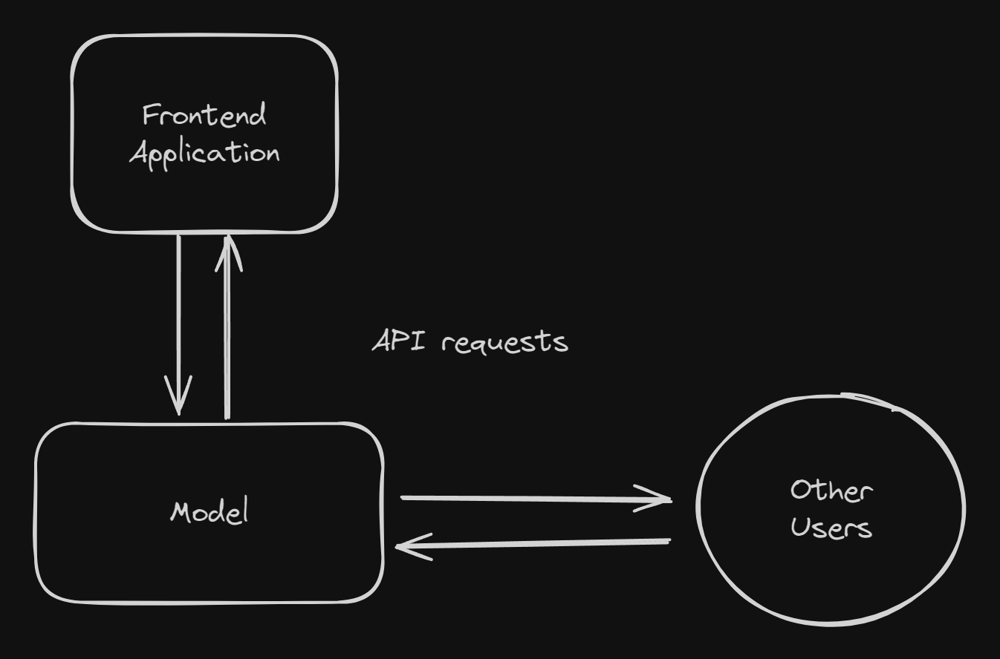
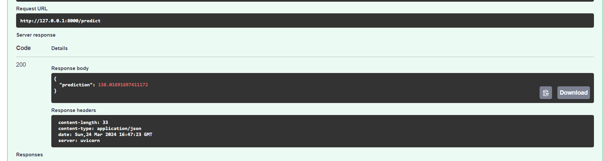
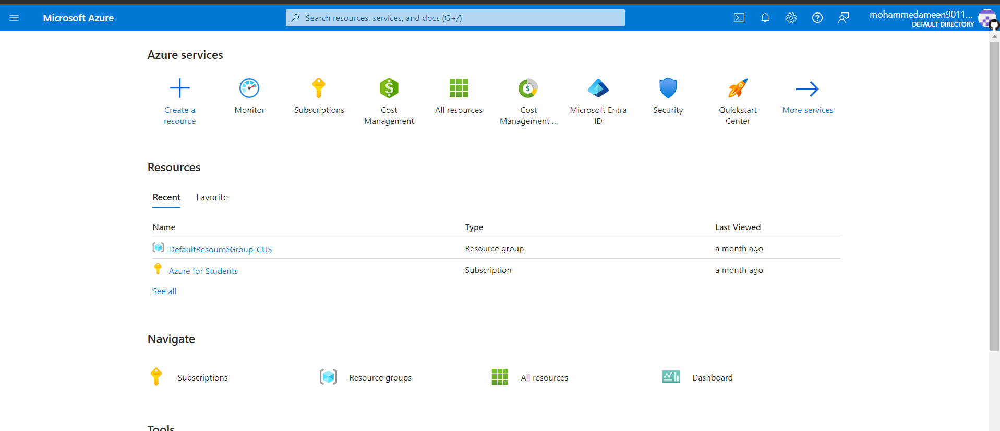
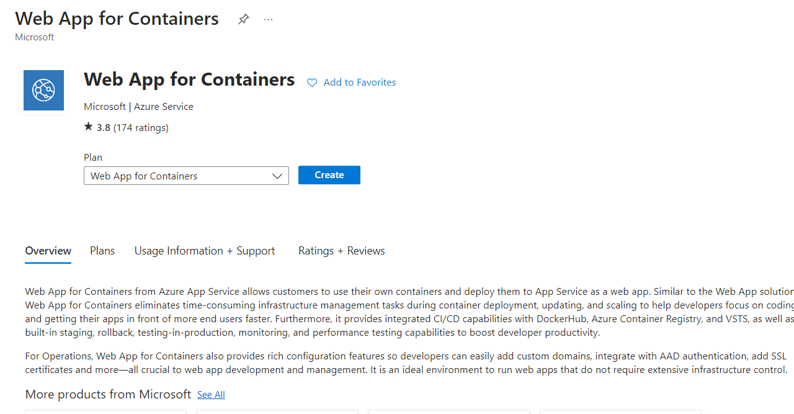
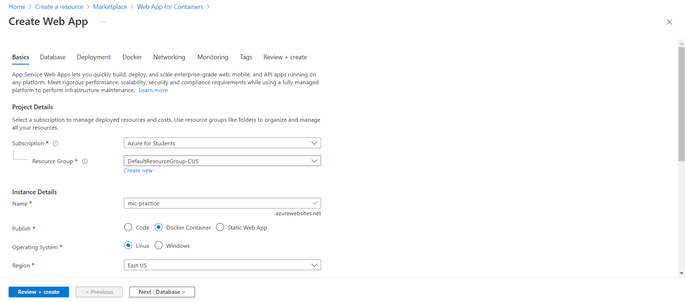
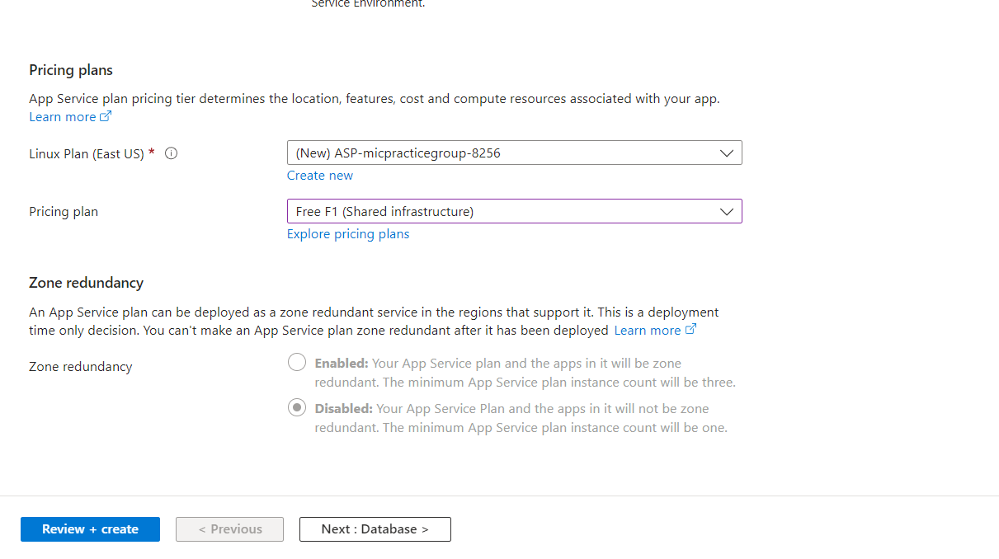
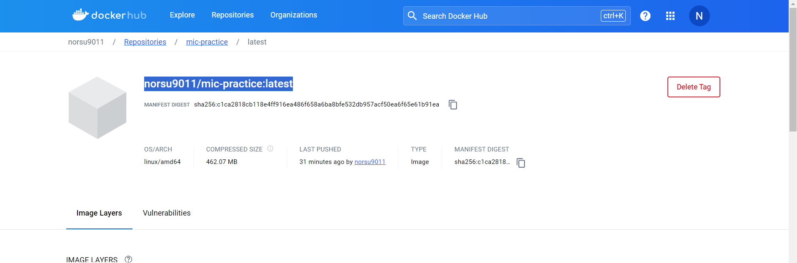
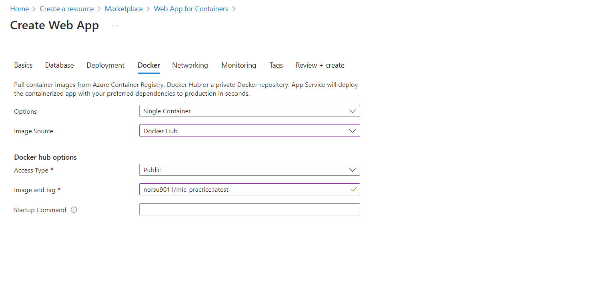
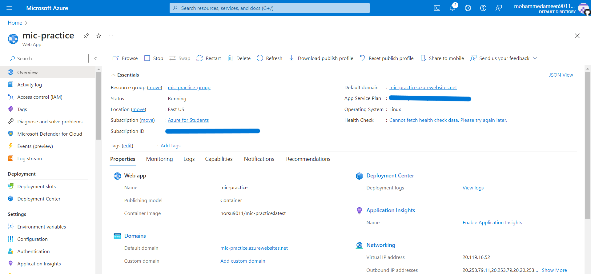
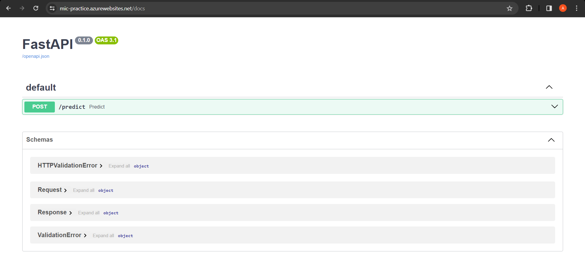

This is meant as somewhat of a guide to the platforms/frameworks that we are going to be using from now on.

This is in no sense meant to be a comprehensive guide for them. The point is to give you a taste of ML Engineering principles on a very shallow level.

## Setting the stage

Lets say you have collected and processed your data, trained and tested your model and now you have a serialized file containing your model. Now what do you do?

Resist the urge to directly load this into some webapp and directly start running inference on it. This might work fine for demonstrations. There are two main problems with this.
First is the lack of modularity, there are two main parts here first the model itself and second the frontend application that is used for inference. If in the future you want to update the model you would have to update the entire application with it as well.

Second is when further down the line the model is used in scenarios you can't predict. For example, you have a model that summarizes text, this is a very general purpose task which can have lots of applications.

So if you want to serve this model, you want to allow a way for you users to simply send requests with the text to the model and receive the summarized text as the response.

This is where Model As a Service (MaaS) comes in. Here access to the model is in itself the product. For Example, Azure AI Services, Google's Vertex AI etc.
The users will send in an API request to the server running your model and receive a response containing the predictions. And even if you do have a Frontend application, you update each part individually.

That's enough talk for now. So how exactly are we going to achieve this?
We will use a very simple barebones approach onto which further complexity can be added later on.

### 1. Get the Model Ready

Make sure the model is in a consumable format and has the prediction functions ready. For example, if it is a scikit learn model, the entire preprocessing/prediction pipeline is pickled such that when running inference you just pass in the data and don't have to worry about the various  preprocessing steps. Otherwise you can apply the appropriate steps after loading the raw model.

### 2. FastAPI Server

First lets create a virtual environment, it is recommended you use conda for that but you can use whatever you are comfortable with.

~~~
conda create -n mic-practice python=3.12
~~~

Now lets activate the environment

~~~
conda activate mic-practice
~~~

Next we have to install FastAPI and uvicorn

~~~
pip install fastapi "uvicorn[standard]" pydantic pandas scikit-learn
~~~

Now that FastAPI is installed lets set up our application.

Create a file by the name of "main.py"

~~~python
from fastapi import FastAPI 

app = FastAPI() 

@app.get("/") 

async def read_root(): 
 return {"Hello": "World"}

~~~

Now to run this application go to the terminal and enter

~~~
uvicorn main:app
~~~

and you should be able to access the app at <code>http://127.0.0.1:8000/</code>

Now time to load the model.

~~~python
from fastapi import FastAPI
import pickle as pk
import pandas as pd
from pydantic import BaseModel
from pathlib import Path

app = FastAPI()

class Request(BaseModel):
    Birth_Rate: float
    Fertility_Rate: float
    Infant_mortality: float
    Maternal_mortality_ratio: float
    Physicians_per_thousand: float

class Response(BaseModel):
    prediction: float

model = pk.load(open(Path(__file__).parent / "model.pickle", "rb"))

@app.post("/predict", response_model=Response)
async def predict(request: Request) -> Response:
    x = pd.DataFrame([request.dict()])
    x.columns = [
        "Birth Rate",
        "Fertility Rate",
        "Infant mortality",
        "Maternal mortality ratio",
        "Physicians per thousand",
    ]
    return Response(prediction=model.predict(x)[0])
~~~

Lets break down the code.

~~~python
from fastapi import FastAPI
import pickle as pk
import pandas as pd
from pydantic import BaseModel
~~~

We first import all the required libraries. Pickle for loading the serialized mode. Pydantic for type validation (we want to make sure that requests and responses correspond to certain data types for example: float).

~~~python
app = FastAPI()
~~~

We create a FastAPI app instance.

~~~python
class Request(BaseModel):
    Birth_Rate: float
    Fertility_Rate: float
    Infant_mortality: float
    Maternal_mortality_ratio: float
    Physicians_per_thousand: float

class Response(BaseModel):
    prediction: float
~~~

Here we create pydantic models describing the Request and Response classes. Basically it means that we can make sure that they correspond to the a specific format.

~~~python
model = pk.load(open(Path(__file__).parent / "model.pickle", "rb"))
~~~

We load the model.

~~~python
@app.post("/predict", response_model=Response)
async def predict(request: Request) -> Response:
    x = pd.DataFrame([request.dict()])
    x.columns = [
        "Birth Rate",
        "Fertility Rate",
        "Infant mortality",
        "Maternal mortality ratio",
        "Physicians per thousand",
    ]
    return Response(prediction=model.predict(x)[0])
~~~

Finally the most important part.
Here <code>@app.post</code> decorator tells the app to execute this function whenever a post request is sent to the <code>/predict</code> endpoint. The function takes a **Request** Object as an input and returns a **Response** Object after passing the response through the model.

Alright we have finally created the FastAPI application. Time to test it.
Go to <code>http://127.0.0.1:8000/docs</code>

Here you can see the API endpoint.
Lets test it!

Trying out with some random values.

There we go we. It works! Well the API atleast not really sure about the model, don't know of a country which has a life expectancy of 138.

Now that we have the FastAPI, time to prevent a very important problem.

## Docker

If you don't get anything out of this article, atleast I want you to get a decent idea of Docker. Docker on very basic level is supposed to prevent this problem.

We'll be working on tons of projects together. And ML projects are a dependency hell. You hundreds of libraries and hundreds of versions of those libraries. Even a small discrepancy can lead to not just a severely painful deployment experience but also frustration for your team mates.

To solve this we'll use Docker. On the surface level just packages your application and dependencies in a container which can run anywhere.

The process of building a docker container is quite simple.

First install docker.
<https://docs.docker.com/get-docker/>

Once installed. Run the docker daemon.

Create a new directory called app in your project directory and put the main.py and model files in the app directory. Also create an empty \__init\__.py in the same directory. Create a requirements.txt file by running this command.

~~~
pip freeze -> requirements.txt
~~~

Create a new file called Dockerfile in the main directory. Inside it add.

~~~Dockerfile
FROM python:3.12.2-slim

WORKDIR /code

COPY ./requirements.txt /code/requirements.txt 

RUN pip install --no-cache-dir --upgrade -r /code/requirements.txt

COPY ./app /code/app

EXPOSE 80

CMD ["uvicorn", "app.main:app", "--host", "0.0.0.0", "--port", "80"]
~~~

In this file we configure the build. First we pull the base python image from the Dockerhub repository. Then we specify the working directory as /code. We copy the requirements.txt file from the host machine into the working directory.

~~~Dockerfile
RUN pip install --no-cache-dir --upgrade -r /code/requirements.txt
~~~

Here the we install all the dependencies specified in requirements.txt.

~~~Dockerfile
CMD ["uvicorn", "app.main:app", "--host", "0.0.0.0", "--port", "80"]
~~~

Finally we run the above command to start the FastAPI app at 0.0.0.0 on port 80.

Now that the Dockerfile is created, its time to build the image.
The directory structure should look something like this.

~~~
- parent
 - app
  - __init__.py
  - main.py
  - model.pickle
 - Dockerfile
 - requirements.txt
~~~

To build the container run this command.

~~~
docker build -t mic-practice . 
~~~

Once the build is finished you can run the Docker container.

~~~
docker run -d --name test -p 80:80 mic-practice   
~~~

Here we create a container called test from the image mic-practice and we map the port 80 of the host to the port 80 of the container. This way any requests sent to port 80 of the host will be forwarded to port of the container (where the app is running).

Finally you should be able to access the app at <code>http://127.0.0.1:80/</code>

Before we move onto the next step, there is one last thing we must do.

We have to upload our image to Dockerhub. This we can access it from anywhere. For this you need to create an account on <https://hub.docker.com/>

First we have to change the name of our docker image to "username/image-name"

~~~
docker tag mic-practice norsu9011/mic-practice
~~~

Then we login using docker credentials.

~~~
docker login
~~~

And finally push the image to Dockerhub using.

~~~
docker push norsu9011/mic-practice
~~~

Now we are finally ready to jump into the cloud.

## The Cloud

For this step we could have used any of the the big three AWS/Azure/GCP. On top of that there are several ways of running a container on the cloud. We'll stick with Azure. Mainly because Azure gives 100$ in free credits to students.

As for the service we'll use the easiest method WebApp for Containers.

Let's Begin.

First Login to the Azure Portal.

After logging in click on Create a resource.

Search for Web App for Containers.

Click on Create.

Select a resource group and a name.

Change the Pricing plan to F1 for testing purposes. Later you can use dedicated plans.

Now go to Dockerhub and repository with your image. Copy the tag of the image.

Go to the Docker section and Choose image source as Dockerhub and paste the image tag. After that click on review and create and create your webapp instance.

It will take a minute or so to launch the instance. Once launched go to the service page. Here you will find the Default Domain of the service. Here it is <https://mic-practice.azurewebsites.net/>

You can access the app using this url.

Finally we can test whether the API is working or not using a 3rd party tester from <https://reqbin.com/>
We can see that the /predict endpoint works perfectly.

And with that we have successfully deployed our model as a service onto the cloud. The model inference API can be used by anything that can send and receive HTTP requests.

I hope you got some idea of how you can get your models to production. This was in no way a comprehensive look on the entire process. There are a lot of parts missing. And this was just the Deployment part.

As a part of the total ML arsenal this is less than 1/3rd of what we will be using in future projects. There is a lot more to learn.

That being at least we are out of the notebook. Thanks for following this guide till the end and hopefully you have learnt a little more about the ML arsenal by now.

Keep Learning :)
